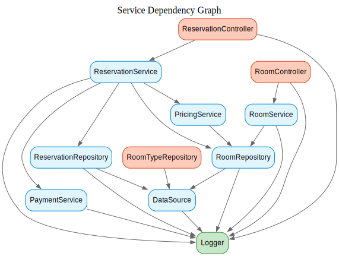

# 🌟 Stellar Hotel Stays

**Stellar Hotel Stays** is a backend API system designed to manage hotel room reservations.  
It provides endpoints to create rooms, check availability, and make reservations — with a modular architecture for scalability and maintainability.

---

## 🏨 Project Overview

Stellar Hotel Stays is a **Room Reservation API**, built with Node.js and TypeScript, following clean architecture principles.  
It is designed for future extensibility — such as pricing rules, payments, and advanced booking flows — while maintaining clear separation of concerns.

---

## ⚙️ Tech Stack

- **Node.js** — Runtime environment  
- **Express.js** — Web framework  
- **TypeScript** — Type safety and developer productivity  
- **PostgreSQL** — Relational database  
- **Docker / Docker Compose** — Containerization and orchestration  
- **Grafana + Loki** — Logging and monitoring stack  

---

## 🚀 Getting Started

### 1. Clone the Repository

```bash
git clone https://github.com/<your-username>/stellarHotelStays.git
cd stellarHotelStays
````

### 2. Start the Application

Run the following command to start all services (API, PostgreSQL, Grafana, Loki):

```bash
docker-compose -f docker-compose.dev.yml up --build
```

This will:

* Build the Node.js application.
* Start PostgreSQL with preconfigured credentials.
* Launch Grafana for dashboards.
* Launch Loki for centralized logging.

---

## 📚 Usage

Once the containers are running:

* **API Documentation (Swagger UI):**
  👉 [http://localhost:3000/api-docs/](http://localhost:3000/api-docs/)

* **Grafana Dashboard:**
  👉 [http://localhost:3001/](http://localhost:3001/)

---

## 🌐 API Endpoints

| Feature             | Endpoint               | Method | Description              |
| ------------------- | ---------------------- | ------ | ------------------------ |
| Create Room         | `/api/rooms`           | `POST` | Create a new room        |
| Get Available Rooms | `/api/rooms/available` | `GET`  | Retrieve available rooms |
| Reserve Room        | `/api/reservations`    | `POST` | Make a room reservation  |

Full API documentation is available in Swagger at
👉 [http://localhost:3000/api-docs/](http://localhost:3000/api-docs/)

---

## 🧩 Project Structure

```
src/
├── config/             # Tool and integration configurations (Swagger, etc.)
├── errors/             # Common HTTP error definitions
├── middlewares/        # Global and route-specific Express middlewares
├── models/             # Core models represented as TypeScript classes
├── modules/            # Main business modules
│   ├── room/           # Room module (controllers, use cases, DI)
│   ├── reservation/    # Reservation module (controllers, use cases, DI)
│   ├── pricing/        # Pricing logic module (discounts, weekend rates)
│   ├── payment/        # Payment gateway integration (future)
│   ├── database/       # Database setup and ORM/entity definitions
│   ├── data/           # Repository implementations
│   └── common/         # Shared utilities (env loader, logger, helpers)
│
├── main.ts             # Application entrypoint:
│                       # - Swagger setup
│                       # - Base routes
│                       # - Middleware registration
└── ...
```

This modular layout allows for clear separation between:

* **Configuration** (setup, tools)
* **Domain logic** (models, errors)
* **Infrastructure** (database, repositories)
* **Application** (modules and dependency injection)
* **Interfaces** (controllers and routes)
---
## 🕸️ Service Dependency Graph


---

## ⚙️ Environment Variables

Configure your environment in `.env` or via Docker Compose:

| Variable            | Description              | Default                 |
| ------------------- | ------------------------ | ----------------------- |
| `NODE_ENV`          | Node environment         | `development`           |
| `POSTGRES_USER`     | PostgreSQL username      | `appuser`               |
| `POSTGRES_PASSWORD` | PostgreSQL password      | `apppassword`           |
| `POSTGRES_DB`       | PostgreSQL database name | `appdb`                 |
| `DB_HOST`           | Database host            | `localhost`             |
| `DB_PORT`           | Database port            | `5432`                  |
| `APP_PORT`          | Application port         | `3000`                  |
| `LOKI_URL`          | Loki logging endpoint    | `http://localhost:3100` |

---

## 🌱 Database Seeding in Development

In development environments, the database is automatically seeded with initial data to simplify testing and local setup.
The seeding process is handled by the seed script located in the database module:

src/modules/database/seed.ts

This script populates the database with essential sample data such as:
- Default room types and pricing
- Example rooms for availability testing

This ensures that your local development database always starts with a consistent baseline for testing and API development.
---

## 📊 Monitoring & Logging

Stellar Hotel Stays integrates **Pino** with **Loki** for structured log management.
Logs can be viewed and queried in **Grafana**, accessible at:

👉 [http://localhost:3001/](http://localhost:3001/)

Typical log queries:

```bash
{app="stellarHotelStays"} |= "info"
{app="stellarHotelStays"} |= "error"
```

---

## 🧪 Testing

Currently, **no automated tests** are included.
Unit and integration testing will be introduced in future versions.

---

## 🧠 Architectural Notes

The project follows **Clean Architecture (Hexagonal Architecture)** principles:

* **Domain Layer:** Business entities and rules (in `models` and `errors`)
* **Application Layer:** Use cases and services (in `modules`)
* **Infrastructure Layer:** Repositories and database adapters
* **Interface Layer:** HTTP endpoints and middleware (in `main.ts` and `middlewares`)

This ensures loose coupling between business logic and external technologies.

---

## 🧰 Development Notes

* **Swagger** is configured in `src/config/` and initialized in `main.ts`
* **Dependency Injection** is handled at the module level
* **Custom Errors** are defined in `src/errors/`
* **Environment variables** are validated and loaded from `src/modules/common/env.ts`
* **Logger** is implemented in `src/modules/common/logger.ts`

---

## 🤝 Contributing

Contributions are welcome!
To contribute:

1. Fork this repository.
2. Create a new branch:

   ```bash
   git checkout -b feature/your-feature-name
   ```
3. Commit your changes:

   ```bash
   git commit -m "Add new feature"
   ```
4. Push and open a pull request.

---
## 👨‍💻 Author

**Elias Lezcano**
Creator & Maintainer — Stellar Hotel Stays